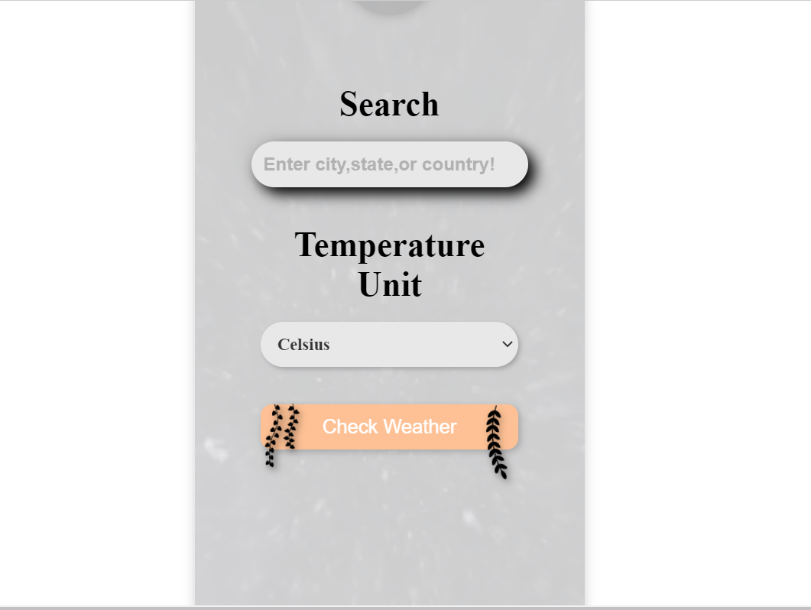

# Weather-Forecast-App
This is a simple web application that provides weather forecasts for cities, states, and countries. Users can search for a location and view the current weather conditions and temperature in their preferred unit (Celsius or Fahrenheit).

  

Weather Forecast App
A visually stunning and user-friendly web application that provides real-time weather forecasts for cities, states, and countries. Stay informed about the weather conditions with a single click!

  

Features
🔍 Location Search: Easily search for a location by entering the city, state, or country. Get accurate weather forecasts tailored to your preferred destination.

🌡️ Temperature Unit Selection: Choose your preferred temperature unit to display weather information. Switch effortlessly between Celsius and Fahrenheit.

🌤️ Real-Time Weather Updates: Instantly retrieve the current weather conditions and temperature for the selected location. Stay informed about the atmospheric state wherever you are.

🎥 Immersive Visuals: Enjoy a captivating background video that adds a touch of elegance to the user interface. Enhance your weather-checking experience like never before.

Technologies Used
🌐 HTML5: Markup language used for structuring the application.

🎨 CSS3: Styling the web elements to create an appealing and visually rich interface.

🚀 JavaScript: Programming language used to add interactivity and fetch weather data.

🌍 OpenWeatherMap API: Integration with the OpenWeatherMap API to retrieve accurate and up-to-date weather information.

Usage
Clone the Repository: Clone the repository to your local machine.

Launch the Application: Open the index.html file in a web browser of your choice. The application will load instantly, ready to provide you with weather forecasts.

Search for Locations: Enter the desired location in the search field. You can search for a city, state, or even a country. Let the app handle the rest!

Select Temperature Unit: Choose your preferred temperature unit (Celsius or Fahrenheit) from the provided options. The weather information will be displayed accordingly.

Check the Weather: Click on the "Check Weather" button to retrieve the weather forecast for the selected location. Stay informed and plan your day accordingly.

Screenshots

  
  

Contributing
Contributions are more than welcome! If you encounter any issues or have suggestions for improvements, feel free to open an issue or submit a pull request. Let's collaborate and make this project even better!

License
This project is licensed under the MIT License.

Contact
📧 For any further questions or inquiries, please feel free to reach out via email at your-email@example.com.

Acknowledgments
🌟 Special thanks to the following:

OpenWeatherMap for providing the weather data and an amazing API.
The creators of the mesmerizing background video used in the application.
Any other resources or individuals you'd like to acknowledge.
Thank you for checking out the Weather Forecast App! Your feedback and support are highly appreciated. Enjoy seamless weather updates and stay one step ahead of the elements!
